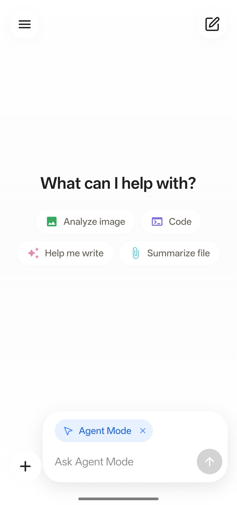
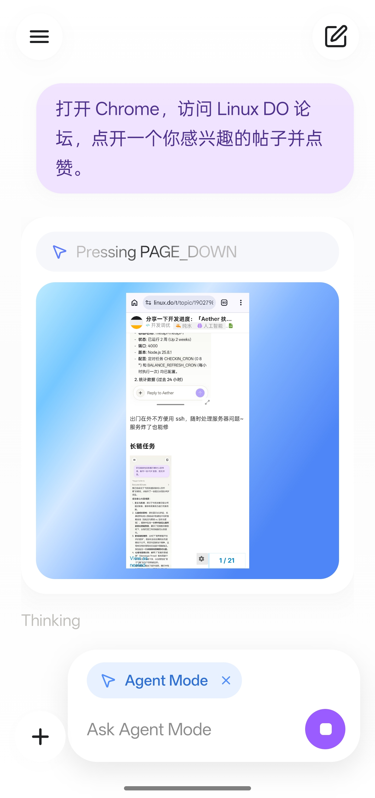
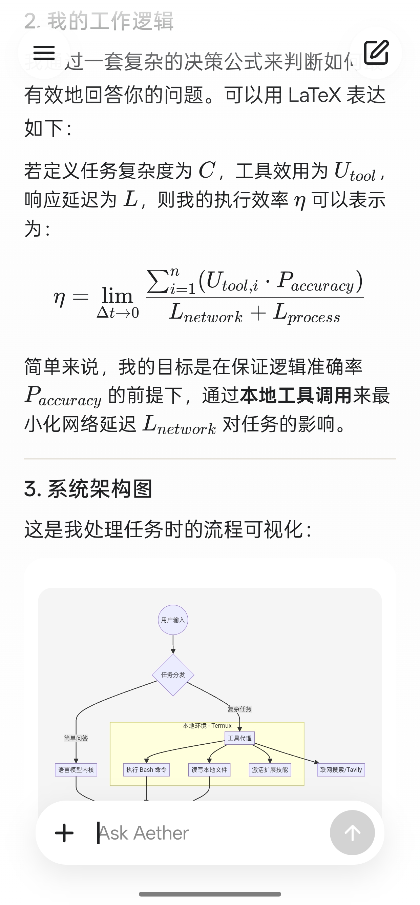
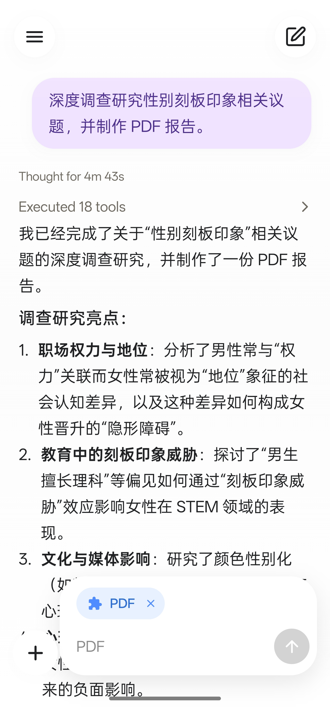
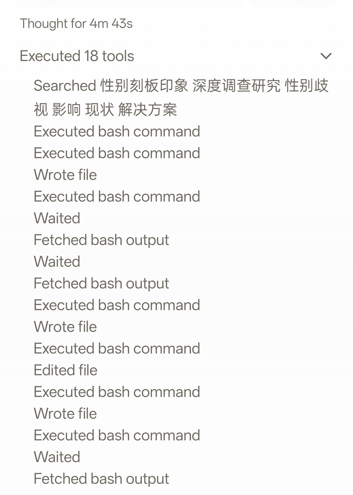
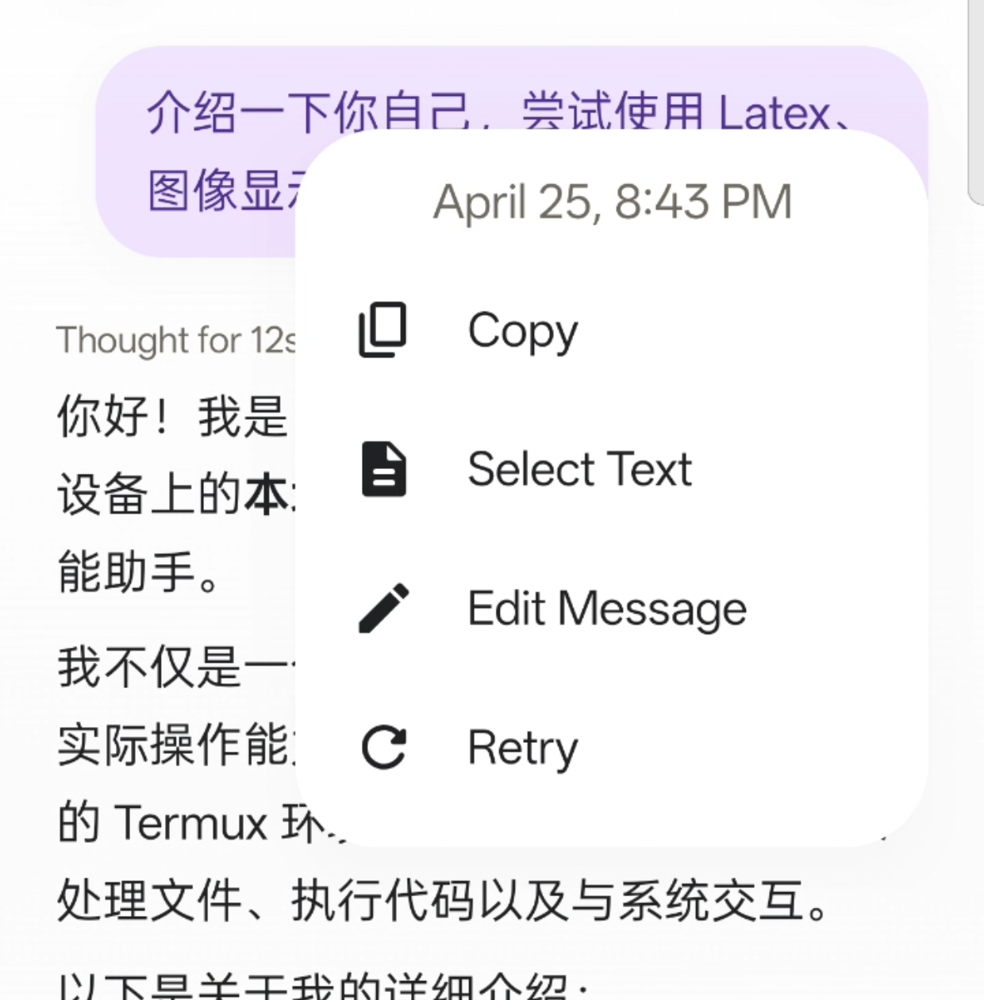

  

<h1 align="center">Aether</h1>

  <strong>Soar with local AI.</strong> 
  A stunning, localized, highly extensible general-purpose AI Agent for Android.

  <a href="README_zh.md">中文</a> •
  <a href="#-visuals--experience">Visuals & Experience</a> •
  <a href="#-high-extensibility">Extensions</a> •
  <a href="#-core-features">Core Features</a> •
  <a href="https://aether.baimoqilin.com/docs">Documentation</a>

  

  <table>
    <tr>
      <td></td>
      <td></td>
      <td></td>
      <td></td>
    </tr>
  </table>

---

## 🌪️ Aether 

> "When the great Peng bird journeys to the Southern Ocean, it flaps the water for three thousand miles, spiraling upward on a whirlwind (*Aether/Fuyao*) to ninety thousand miles, and travels for six months before resting."

**Aether** is dedicated to bringing a modern, local AI Agent experience to Android devices. Built on top of the Pi framework, it pairs a minimalist, polished UI with immense extensibility, seamless tool calling, and full extension ecosystem support.

## 🧩 High Extensibility

Aether natively supports loading standard [Pi Extensions](https://github.com/earendil-works/pi). To bring TUI-oriented extensions seamlessly to mobile touchscreens, Aether provides a rich **Extension API** allowing extensions to inject custom settings cards, interactive composer widgets, overlay transcript viewers, prompt interceptors, and semantic tool titles.

| Extension | Description | Repository |
| :--- | :--- | :--- |
| **Pi Web Access*** | Web search across 20+ providers (OpenAI, Brave, Exa, Tavily, Perplexity, Gemini, SearXNG), GitHub repo cloning, PDF extraction, and YouTube/video understanding with native settings and transcript cards. | [AetherExtensions/pi-web-access](https://github.com/AetherExtensions/pi-web-access) |
| **Pi MCP Adapter*** | Model Context Protocol (MCP) gateway supporting Stdio, Streamable HTTP, SSE, and Unix domain sockets with lazy loading, token-saving tool discovery, interactive OAuth authentication, and a visual server management GUI. | [AetherExtensions/pi-mcp-adapter](https://github.com/AetherExtensions/pi-mcp-adapter) |
| **Pi Subagents*** | Claude Code-style autonomous sub-agents with parallel background execution, mid-run steering, live widget & FleetView cards above the composer, conversation overlay viewer, and `@handle` prompt mentions. | [AetherExtensions/pi-subagents](https://github.com/AetherExtensions/pi-subagents) |

*\* means it's an official extension adapted by the Aether team. Add your extension to the list by [submitting a PR](https://github.com/Zhou-Shilin/Aether/pulls).*

Extensions can be installed directly as zip packages in **Settings → Extensions → Import extension**.

For extension development documentation, see <https://aether.baimoqilin.com/docs/extensions/overview.md>.

## 📱 Visuals & Experience

Aether's UI and interactions are heavily inspired by excellent, mature applications like ChatGPT, Codex CLI/App, Gemini, and Poco Agent. Every animation and interaction detail has been carefully polished to break the stereotype that "open-source means cheap and unrefined."

  <table>
    <tr>
      <td></td>
      <td></td>
      <td></td>
    </tr>
  </table>

## ✨ Core Features

- **Stunning UI & Silky Smooth Interactions**: Distilling the design essence of top-tier apps like ChatGPT to create a minimalist, modern, and elegant interface.
- **Pi Harness Kernel**: Powered by the Pi framework, providing the widest LLM provider compatibility and a lightweight, highly efficient Agent execution engine.
- **Extreme Extensibility**: Inherits Pi's complete extension model while providing Aether's proprietary Script Extensions and Native Mods system to deeply customize mobile UI, settings, composer widgets, and runtime behavior.
- **Built-in Alpine VM**: Includes an automatically installed Alpine Linux environment to run shell commands and tools out of the box.
- **System File Manager Access** (Android): After initializing Alpine, select **Aether (Alpine)** in the system Files app or SAF document picker's sidebar to browse the environment and `/workspace`, create, edit, rename, delete, or copy files between Alpine and device storage. Changes apply directly to the files used by proot. System mounts such as `/dev`, `/proc`, and `/sys` are excluded.
- **Extensible Host Control**: Supports optional Shizuku and Termux integration for direct device manipulation and automation. (Android only)

## 🚀 Quick Start

See <https://aether.baimoqilin.com/docs/quickstart>.

## 🤝 Contributing

This project is being developed sporadically by a 15yo student during their spare time (⁠ʘ⁠ᴗ⁠ʘ⁠✿⁠). Aether is still actively iterating and being polished. If you like this project, please consider giving it a ⭐ Star, or submit PRs and Issues to help make Aether even better!

## Special Thanks

- OpenAI Codex
- Google Gemini
- [Linux DO Community](https://linux.do/)

## Star History

<a href="https://www.star-history.com/?repos=Zhou-Shilin%2FAether&type=date&legend=top-left">
 <picture>
   <source media="(prefers-color-scheme: dark)" srcset="https://api.star-history.com/chart?repos=Zhou-Shilin/Aether&type=date&theme=dark&legend=top-left&sealed_token=EU5gsuVcs_Ravu88uM-u6K0mIGb0JVSVe65e7hxAoH_ZncZr6UgJy4gc1g-EF61t1btQdTyt7Nyo89r9dQvgFzXlIL8P9ebP6orOqbiVMs7vueE4DyTGaIWho_-VEiLYzE6mW76DqgnU00qG0i_JZmFL08ZPdWMRv0hEkUK9NQi_fBuUMqSOqYQNCMO6" />
   <source media="(prefers-color-scheme: light)" srcset="https://api.star-history.com/chart?repos=Zhou-Shilin/Aether&type=date&legend=top-left&sealed_token=EU5gsuVcs_Ravu88uM-u6K0mIGb0JVSVe65e7hxAoH_ZncZr6UgJy4gc1g-EF61t1btQdTyt7Nyo89r9dQvgFzXlIL8P9ebP6orOqbiVMs7vueE4DyTGaIWho_-VEiLYzE6mW76DqgnU00qG0i_JZmFL08ZPdWMRv0hEkUK9NQi_fBuUMqSOqYQNCMO6" />
   
 </picture>
</a>

---

## 📄 License

This project is licensed under the **GPL-3.0 License**.

---

  Built with ❤️ by Shilin "BaimoQilin" Zhou.

